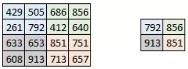
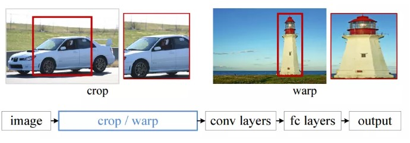
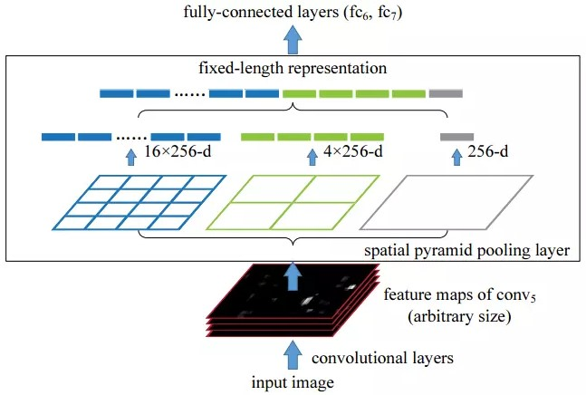
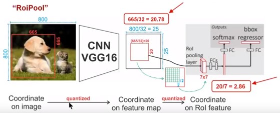
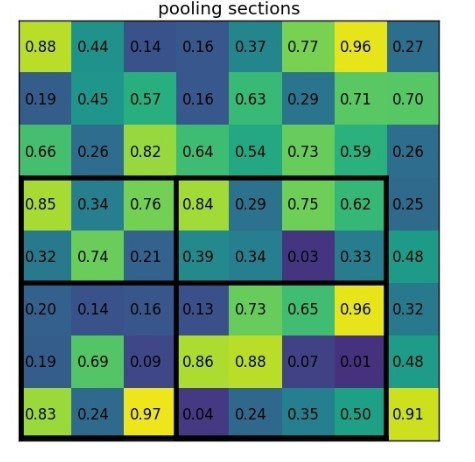
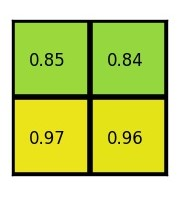
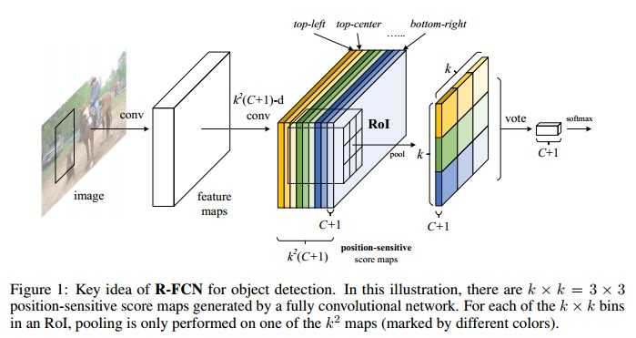
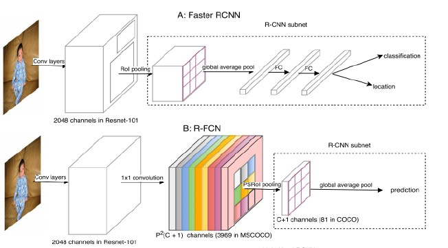
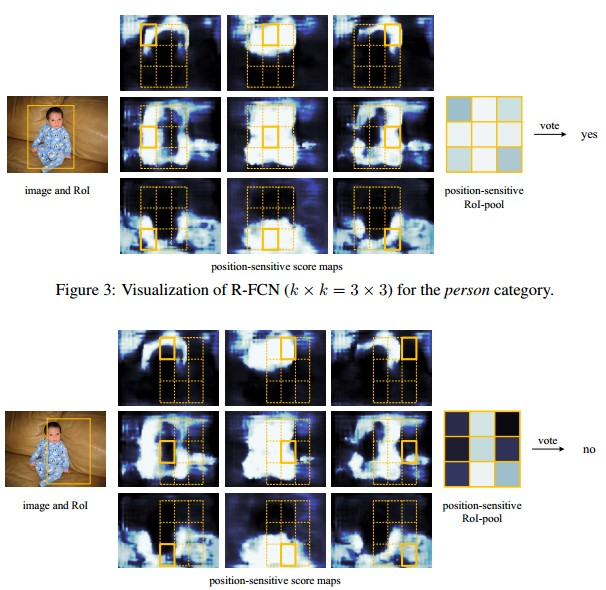

# 池化
* 减小特征图的尺寸（加快计算）和压缩特征，提取主要特征
* 常见的池化主要有最大、最小、平均池化  

# ROI池化（region of interest）
* 最早出现在分类的任务中，需要把不同大小的图片映射到相同大小的向量然后进行分类。
早期解决输入图片的尺寸大小不同的方法：crop/wrap  

* 但是crop/wrap会造成物体变形或者信息的丢失，影响识别精度。
* 最先提出解决办法的是spp（2014）的spatial pyramid pooling  

* 后来fast-rcnn借鉴了spp思想并且简化成为了ROI，可以理解成为单尺度的spp  

* roi的作用是：生成的候选框region proposal映射产生固定大小的feature map，
然后进行分类和框回归
* 可以看出ROI pooling得到的特征表示是固定长度的，与输入无关。  

# PSROI（position-positive RoI pooling）
* 在R-FCN: Object Detection via Region-based Fully Convolutional Networks（2016）
中提出分类是要增加物体的平移不变性(不同的位置都是同一个物体)；
目标检测时减少物体的平移变化(目标检测需要画出物体所在的框）。
CNN的模型用于分类任务，那么会偏向于平移不变性，这和目标检测就出现了矛盾。
* 所以论文提出了position-positive RoI pooling——位置敏感的感兴趣区域池化操作，
* 该操作在分类和回归中有一点不同，但大体思想都差不多。
## 分类
* position-sensitive score map+ RoI pooling layer  

* KxK:感兴趣区域划分的网格数，例如K = 3, 3*3的总共有9个spatial grid分别对应着一个类别物体的9中位置{top-left, top-center,top-right,…, bottom-right}
* C:分类的类别的数目,每一个颜色的特征图块里面是C+1个类方框中一个位置的得分图，比如……
* 使用3*3的RoI pooling，池化操作就是在该bin对应的score map上的子区域执行，且执行的是平均池化，每一个RoI会生成一个k∗k∗(C+1)的feature map。对k∗k∗(c+1)的feature map 进行 average pooling（投票），会产生(c+1)维的置信度，然后通过softmax（不需要真正的，只需要比较大小即可）既可得到属于哪个类别的可能性。  

### 可视化：  
* 
## 回归（Position-Sensitive Regression）
* regression score map+RoI pooling
* 每个RoI还需要 4个数作为回归偏移量，也就是x,y,w,h的偏移量
* 在ResNet的共享卷积层的最后一层上面连接一个与position-sensitive score map并行的score maps，
该score maps用来进行regression操作，我们将其命名为regression score map，
而该regression score map的维度应当是 4*K*K，然后经过Position-sensitive RoI pooling操作后，
每一个RoI就能得到4个值作为该RoI的x,y,w,h的偏移量了，其思路和分类完全相同。
* 也就是每个颜色块还是表示对不同位置的响应，只不过现在的响应是对回归框的四个值，
然后对这四个值做平均（投票）就可以得到最后的值。

[参考博客](https://blog.csdn.net/WZZ18191171661/article/details/79481135)  
[RFCN:Object Detection via Region-based Fully Convolutional Networks](https://arxiv.org/abs/1605.06409)